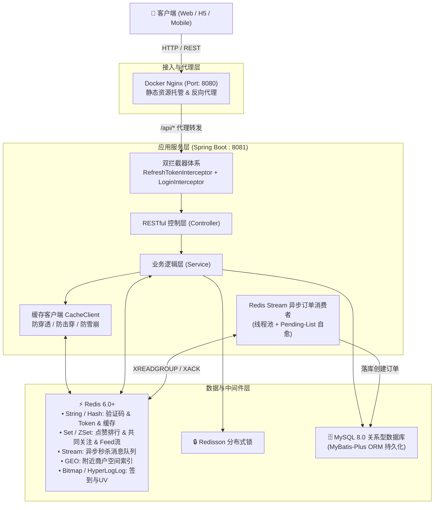
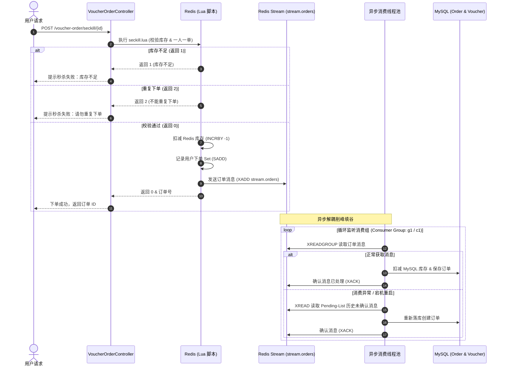
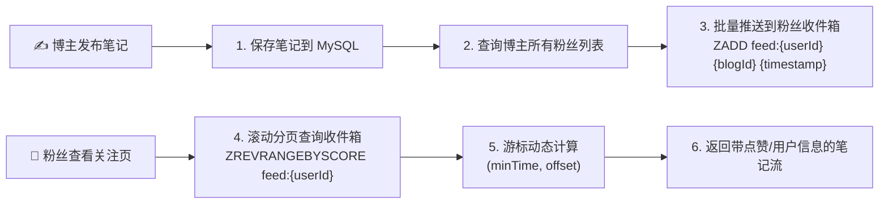

# 📱 黑马点评 (HM-DianPing)

<p align="center">
  
  
  
  
  
  
  
</p>

---

## 📖 项目简介

**黑马点评 (HM-DianPing)** 是一套基于 **Spring Boot + Redis** 架构的高性能本地生活服务与点评分享平台。系统深度融合了 Redis 的各类高级数据结构与分布式特性，涵盖**高并发优惠券秒杀**、**企业级多级缓存治理**、**基于 GEO 的附近商户检索**、**推模式（Push）社交 Feed 流**、**Bitmap 签到与连续打卡统计**、**无状态分布式 Session** 等核心业务场景。

项目注重生产级的高并发、高可用设计，包含了 Lua 脚本原子操作、Redis Stream 异步消息队列解耦、Pending-List 异常重试自愈、Redisson 分布式锁、优雅停机等实战技术方案。

---

## 🏗️ 系统架构设计



---

## 🛠️ 技术栈清单

| 分类 | 技术组件 | 版本 | 说明 |
| :--- | :--- | :--- | :--- |
| **核心框架** | Spring Boot | 2.3.12.RELEASE | 基础微服务开发框架 |
| **持久层** | MyBatis-Plus | 3.4.3 | 增强型 ORM 框架，简化 CRUD 与分页 |
| **数据库** | MySQL | 8.0+ | 核心业务数据关系型数据库 |
| **缓存/中间件** | Redis + Lettuce | 6.0+ / 6.1.9 | 缓存加速、分布式锁、Stream 消息队列、GEO 检索 |
| **分布式锁** | Redisson | 3.13.6 | 分布式可重入锁、看门狗机制 |
| **开发工具库** | Hutool | 5.7.17 | Java 常用工具类（Bean 转换、加密、正则、时间处理） |
| **代码简化** | Lombok | 1.18.30 | 消除冗余 Getter/Setter 与构造器代码 |
| **前端/部署** | Docker + Nginx | stable-alpine | 前端静态页面托管与反向代理 |

---

## 🌟 核心业务方案与技术攻坚

### 1. ⚡ 极致高并发优惠券秒杀方案

针对秒杀场景下的**高并发读写**、**超卖问题**、**一人一单限制**与**数据库写入瓶颈**，系统设计了基于 **Redis + Lua + Stream 异步解耦** 的完整方案：



- **原子性保障**：使用 Lua 脚本（`seckill.lua`）一次性完成**优惠券库存校验**、**用户一人一单判断**、**库存预扣减**及**推入 Stream 消息队列**，杜绝并发超卖与超买。
- **分布式 ID 生成**：基于 Redis `INCR` 与自增序列，结合时间戳构造 64 位全局唯一分布式订单 ID（保证单调递增与安全性）。
- **异步下单削峰**：引入 Redis Stream 作为轻量级消息队列，后台单线程池持续消费，平滑数据库写入压力。
- **故障自愈机制**：消费异常或宕机时，未 ACK 的消息进入 `Pending-List`，重启后自动通过 `ReadOffset.from("0")` 恢复消费并完成 ACK。
- **优雅停机保护**：通过 `@PreDestroy` 结合 `shouldRun` 状态位与线程池 `awaitTermination`，确保在容器停止时未完成的消费任务平稳落库。

---

### 2. 🛡️ 企业级多级缓存设计与三大经典问题治理

封装通用缓存客户端 [`CacheClient`](file:///Users/li/Code/Java/JavaProjects/hm-dianping/src/main/java/com/hmdp/utils/CacheClient.java)，采用函数式编程（`Function<ID, T>`）实现任意业务对象的透明缓存：

| 缓存痛点 | 发生场景 | 解决方案与落地实现 |
| :--- | :--- | :--- |
| **缓存穿透** | 查询数据库与缓存中均不存在的数据，请求直达 DB | **空值缓存**：查询 DB 为空时向 Redis 写入特殊标记 `_empty_`，设置短 TTL（如 2 分钟），后续直接命中空缓存拦截。 |
| **缓存击穿** | 热点 Key 突发过期，海量并发瞬间穿透至数据库 | **互斥锁重建**：利用 Redis `SET key value NX EX` 实现轻量级互斥锁，仅允许单线程查询 DB 并重建缓存，其余线程自旋重试；亦支持逻辑过期机制。 |
| **缓存雪崩** | 大量 Key 设置相同过期时间，同一时刻集中失效 | **TTL 随机浮动**：在基准过期时间（如 30 分钟）上动态叠加随机抖动时间（`time + Math.random() * 10`），有效打散过期波峰。 |
| **数据一致性** | 数据库更新时缓存与 DB 状态不一致 | **Cache-Aside 策略**：修改数据时先更新数据库，再主动删除对应 Redis 缓存，保证最终一致性。 |

---

### 3. 📍 附近商户检索与空间计算 (LBS / GEO)

- **GEO 空间索引**：按商户类别分片存储地理坐标（`shop:geo:{typeId}`），利用 Redis 的 `GEOADD` 实现经纬度与商户 ID 绑定。
- **范围与距离检索**：使用 `GEORADIUS` / `GEOSEARCH` 检索指定坐标周围 5000 米内的商户，同时返回精确直线距离。
- **内存分页与排序**：对检索出的结果进行逻辑分页截取，并通过 MyBatis-Plus `ORDER BY FIELD(id, ...)` 保证查询结果与距离排序严格一致。

---

### 4. 📮 探店笔记与推模式社交 Feed 流



- **推模式（Push）Timeline**：博主发布笔记后，系统异步查询其粉丝列表，并将笔记 ID 与当前时间戳推入所有粉丝的收件箱（Redis ZSet `feed:{userId}`）。
- **滚动分页（Scroll Pagination）**：针对持续动态更新的 Feed 流，传统 `page/size` 会导致数据重复或漏读。基于 `ZREVRANGEBYSCORE` 配合当前最小时间戳游标 `lastId` 与同分偏移量 `offset`，实现平滑稳定的无限滚动分页。
- **点赞与点赞排行榜**：使用 Redis ZSet 存储点赞记录（Score 为点赞时间戳），既可实现 $O(1)$ 的一人一赞去重与状态判断，又能快速分页查询最早点赞的 Top 5 用户。
- **共同关注计算**：使用 Redis Set 存储用户关注列表（`follows:{userId}`），基于 `SINTER` 命令秒级计算两个用户的共同关注好友。

---

### 5. 📅 用户签到与活跃度统计 (Bitmap & HyperLogLog)

- **高效签到打卡**：基于 Redis Bitmap（位图），将用户 ID 与当前年月份组合为 Key（`sign:{userId}:{yyyyMM}`），以“日 - 1”作为偏移量执行 `SETBIT`，每个用户单月打卡记录仅消耗约 4 字节内存。
- **连续签到天数统计**：调用 `BITFIELD` 批量获取截至当天的无符号整型数据（`u[dayOfMonth]`），通过无符号右移（`>>> 1`）与按位与（`& 1`）快速统计当月连续打卡天数。
- **千万级 UV 统计**：引入 Redis `HyperLogLog` 数据结构，以极小的内存开销（12KB）实现亿级独立访客去重统计。

---

### 6. 🔐 无状态分布式 Session 与双拦截器鉴权

- **无状态分布式会话**：验证码存入 Redis（2 分钟有效）；登录成功后生成 UUID Token，以 Redis Hash 结构缓存脱敏的用户信息（`login:token:{token}`）。
- **双层拦截器协同**：
  1. `RefreshTokenInterceptor`（第一层拦截器）：拦截所有请求，尝试解析 Header 中的 `authorization` Token，刷新 Redis 过期时间并存入 `ThreadLocal`，保证活跃用户的会话无感续期。
  2. `LoginInterceptor`（第二层拦截器）：针对受保护接口进行拦截，仅判断 `ThreadLocal` 中是否存在用户信息，不存在则拦截并返回 `401`，并在请求结束后在 `afterCompletion` 中清理 `ThreadLocal`，防止内存泄漏。

---

## 🗃️ Redis 数据模型与 Key 规范全景表

| Key 规范模式 | 数据类型 | 默认 TTL | 业务场景说明 | 核心操作命令 |
| :--- | :--- | :--- | :--- | :--- |
| `login:code:{phone}` | `String` | 2 分钟 | 短信登录验证码缓存 | `SET`, `GET` |
| `login:token:{token}` | `Hash` | 30 分钟 (滑动续期) | 用户分布式登录 Session | `HSET`, `HGETALL`, `EXPIRE` |
| `cache:shop:{id}` | `Hash` | 30 分钟 + 随机抖动 | 商户详情缓存 (防穿透/击穿/雪崩) | `HSET`, `HGETALL`, `DEL` |
| `cache:shop-type:` | `List` | 30 分钟 | 商户类型分类列表缓存 | `LPUSH`, `LRANGE` |
| `lock:shop:{id}` | `String` | 10 秒 | 商户缓存重建互斥锁 | `SET key 1 NX EX 10` |
| `lock:order:{userId}` | `String` / Redisson | 自动续期/租期 | 一人一单防并发重入分布式锁 | Redisson `RLock` |
| `seckill:stock:{voucherId}` | `String` | 永久/活动期 | 秒杀券库存缓存（用于 Lua 原子扣减） | `GET`, `INCRBY` |
| `seckill:order:{voucherId}` | `Set` | 永久/活动期 | 已秒杀用户集合（一人一单校验） | `SADD`, `SISMEMBER` |
| `stream.orders` | `Stream` | 持久队列 | 秒杀订单异步消息队列 | `XADD`, `XREADGROUP`, `XACK` |
| `blog:liked:{blogId}` | `ZSet` | 永久 | 笔记点赞用户及点赞时间戳排序 | `ZADD`, `ZSCORE`, `ZRANGE` |
| `follows:{userId}` | `Set` | 永久 | 用户关注的目标博主 ID 集合 | `SADD`, `SREM`, `SINTER` |
| `feed:{userId}` | `ZSet` | 永久 | 粉丝的 Feed 流收件箱 (Score=发布时间) | `ZADD`, `ZREVRANGEBYSCORE` |
| `shop:geo:{typeId}` | `GEO (ZSet)` | 永久 | 按分类组织的商户地理位置坐标索引 | `GEOADD`, `GEORADIUS` |
| `sign:{userId}:{yyyyMM}` | `Bitmap` | 按月分片 | 用户每日签到打卡位图 | `SETBIT`, `BITFIELD` |

---

## 📂 项目结构规范

```
hm-dianping/
├── .env.example                     # 环境变量模板文件（数据库、Redis 等配置）
├── pom.xml                          # Maven 依赖配置文件
├── README.md                        # 项目工程说明文档
└── src/
    ├── main/
    │   ├── java/com/hmdp/
    │   │   ├── HmDianPingApplication.java  # Spring Boot 启动入口
    │   │   ├── config/              # 核心配置类
    │   │   │   ├── EnvEnvironmentPostProcessor.java # .env 环境变量自动注入处理器
    │   │   │   ├── MvcConfig.java                    # WebMvc 拦截器注册与放行规则
    │   │   │   ├── MybatisConfig.java                # MyBatis-Plus 分页插件配置
    │   │   │   ├── RedissonConfig.java               # Redisson 分布式客户端配置
    │   │   │   └── WebExceptionAdvice.java           # 全局异常捕获与统一响应
    │   │   ├── controller/          # RESTful 接口层
    │   │   │   ├── BlogController.java               # 探店笔记、点赞、Feed 流接口
    │   │   │   ├── FollowController.java             # 关注/取关、共同关注接口
    │   │   │   ├── ShopController.java               # 商户 CRUD、附近商户 GEO 检索
    │   │   │   ├── ShopTypeController.java           # 商户分类接口
    │   │   │   ├── UserController.java               # 用户登录、签到、连续打卡统计
    │   │   │   ├── VoucherController.java            # 普通券/秒杀优惠券发布
    │   │   │   └── VoucherOrderController.java       # 优惠券秒杀下单接口
    │   │   ├── dto/                 # 数据传输对象 (UserDTO, LoginFormDTO, ScrollResult 等)
    │   │   ├── entity/              # 实体类 (User, Shop, Blog, Voucher, VoucherOrder 等)
    │   │   ├── handler/             # 拦截器 (RefreshTokenInterceptor, LoginInterceptor)
    │   │   ├── mapper/              # MyBatis Mapper 接口
    │   │   ├── service/             # 业务接口及实现类
    │   │   └── utils/               # 工具类封装
    │   │       ├── CacheClient.java                  # 通用缓存客户端 (穿透/击穿/雪崩防护)
    │   │       ├── RedisConstants.java               # Redis Key 统一定义
    │   │       ├── RedisIdWork.java                  # 分布式全局 ID 生成器
    │   │       └── UserHolder.java                   # ThreadLocal 用户信息上下文
    │   └── resources/
    │       ├── application.yaml     # 核心配置文件
    │       ├── seckill.lua          # 秒杀库存校验与一人一单原子 Lua 脚本
    │       ├── unlock.lua           # 分布式锁安全释放 Lua 脚本
    │       ├── db/
    │       │   └── hmdp.sql         # 数据库初始化脚本 (表结构及预置测试数据)
    │       └── nginx/               # 前端项目与 Nginx 反向代理配置
    │           ├── conf/nginx.conf  # Nginx 配置文件
    │           └── html/hmdp/       # 前端 H5 静态资源
    └── test/java/com/hmdp/
        └── HmDianPingApplicationTests.java # 单元测试 (GEO 商户预热、ID 生成、HyperLogLog 测试)
```

---

## 🚀 环境准备与快速启动

### 1. 环境依赖要求

- **JDK**: 1.8 或更高版本
- **Maven**: 3.6+（项目内置了 Maven Wrapper `./mvnw`，无需单独安装 Maven 亦可直接运行）
- **MySQL**: 8.0+
- **Redis**: 6.0+（需要支持 Stream 与 GEO 特性）
- **Docker**（可选，用于一键启动 Nginx 前端容器）

---

### 2. 本地快速部署步骤

#### Step 1: 导入数据库脚本
使用 MySQL 客户端或命令行执行 SQL 初始化脚本：
```bash
mysql -u root -p -e "CREATE DATABASE IF NOT EXISTS hmdp DEFAULT CHARACTER SET utf8mb4 COLLATE utf8mb4_general_ci;"
mysql -u root -p hmdp < src/main/resources/db/hmdp.sql
```

#### Step 2: 配置环境变量
项目已内置 `.env` 自动化加载组件。从模板复制一份配置文件：
```bash
cp .env.example .env
```
编辑 `.env`，填入您本地的 MySQL 与 Redis 连接信息：
```dotenv
# 服务端口
SERVER_PORT=8081

# MySQL 数据库配置
MYSQL_HOST=127.0.0.1
MYSQL_PORT=3306
MYSQL_DB=hmdp
MYSQL_USERNAME=root
MYSQL_PASSWORD=your_mysql_password

# Redis 缓存与消息队列配置
REDIS_HOST=127.0.0.1
REDIS_PORT=6379
REDIS_PASSWORD=your_redis_password
```

#### Step 3: 启动前端服务 (Docker Nginx)
利用 Docker 一键挂载并启动 Nginx 前端：
```bash
docker run -d \
  --name hmdp-nginx \
  -p 8080:8080 \
  -v "$(pwd)/src/main/resources/nginx/conf/nginx.conf:/etc/nginx/nginx.conf:ro" \
  -v "$(pwd)/src/main/resources/nginx/html:/usr/share/nginx/html:ro" \
  nginx:stable-alpine
```
> 前端访问地址：[http://localhost:8080](http://localhost:8080)

#### Step 4: 预热商户 GEO 空间数据 (可选)
在启动后端前或启动后，可以运行单元测试将数据库中的商户坐标批量预热导入 Redis GEO：
```bash
# macOS / Linux (推荐使用项目内置 Wrapper)
./mvnw test -Dtest=HmDianPingApplicationTests#loadShopData

# Windows
mvnw.cmd test -Dtest=HmDianPingApplicationTests#loadShopData

# 或使用全局 mvn
mvn test -Dtest=HmDianPingApplicationTests#loadShopData
```

#### Step 5: 启动后端服务
```bash
# macOS / Linux (推荐使用项目内置 Wrapper)
./mvnw spring-boot:run

# Windows
mvnw.cmd spring-boot:run

# 或使用全局 mvn
mvn spring-boot:run
```
后端服务默认监听端口：`http://localhost:8081`。

---

## 🧪 测试账号与高并发压测指南

### 1. 常用业务测试账号

数据库脚本已预设完备的测试数据，可直接用于体验完整功能：

| 用户 ID | 测试手机号 | 昵称 | 预置测试场景与数据 |
| :--- | :--- | :--- | :--- |
| **1** | `13686869696` | 小鱼同学 | 包含多篇探店笔记、大量粉丝关注、点赞互动 |
| **2** | `13838411438` | 可可今天不吃肉 | 包含探店笔记与点赞数据，可用于测试 Feed 流推送 |
| **5** | `13456789001` | 可爱多 | 包含自定义头像与个人主页信息 |
| **4** | `13456789011` | user_slxaxy2au9f3tanffaxr | 普通测试账号 |

> **💡 快速登录方式**：
> 1. 打开前端页面 [http://localhost:8080](http://localhost:8080)，输入上述任意手机号；
> 2. 点击 **“发送验证码”**；
> 3. 查看后端控制台输出的日志（如：`发送验证码成功，验证码为：123456`）；
> 4. 输入控制台中的 6 位数字验证码即可登录。

### 2. 批量压测账号 (用于 JMeter 高并发秒杀测试)

| 用户 ID 范围 | 手机号号段 | 账号数量 | 推荐压测场景 |
| :--- | :--- | :--- | :--- |
| **10 ~ 1009** | `13688668889` ~ `13688669888` | **1000 个** | JMeter 1000 并发抢购优惠券、一人一单校验、Stream 吞吐量测试 |

**压测建议流程**：
1. 调用 `/voucher/seckill` 接口发布一张库存为 100 的秒杀优惠券；
2. 批量生成 1000 个用户的登录 Token，并写入 JMeter CSV 数据集；
3. 配置 1000 线程并发请求秒杀下单接口 `POST /voucher-order/seckill/{id}`；
4. 观察 Redis 库存准确扣减为 0，MySQL 订单精准生成 100 条，无超卖与重复下单，且 Stream 队列全量平稳消费。

---

## 📡 RESTful 核心 API 接口清单

| 业务模块 | 请求方式 | 接口路径 | 功能说明 | 鉴权要求 |
| :--- | :--- | :--- | :--- | :---: |
| **用户模块** | `POST` | `/user/code?phone=xxx` | 发送手机登录验证码 | 否 |
| | `POST` | `/user/login` | 手机号验证码登录/注册 | 否 |
| | `POST` | `/user/sign` | 用户每日签到打卡 | 是 |
| | `GET` | `/user/sign/count` | 统计当月截至今日的连续签到天数 | 是 |
| | `GET` | `/user/me` | 获取当前登录用户信息 | 是 |
| **商户模块** | `GET` | `/shop/{id}` | 根据 ID 查询商户详情（带缓存防穿透/击穿） | 否 |
| | `PUT` | `/shop` | 更新商户信息（双写一致性主动删缓存） | 是 |
| | `GET` | `/shop/of/type` | 根据商户分类与经纬度检索附近商户 (GEO) | 否 |
| | `GET` | `/shop-type/list` | 查询所有商户分类列表（带 Redis 缓存） | 否 |
| **笔记模块** | `POST` | `/blog` | 发布探店笔记并推送到粉丝 Feed 流 | 是 |
| | `GET` | `/blog/{id}` | 查询探店笔记详情与点赞状态 | 否 |
| | `PUT` | `/blog/like/{id}` | 点赞 / 取消点赞笔记 | 是 |
| | `GET` | `/blog/likes/{id}` | 查询笔记点赞排行榜 Top 5 用户 | 否 |
| | `GET` | `/blog/of/follow` | 滚动分页查询关注好友的 Feed 流笔记 | 是 |
| **关注模块** | `PUT` | `/follow/{id}/{isFollow}` | 关注 / 取消关注用户 | 是 |
| | `GET` | `/follow/or/not/{id}` | 查询是否关注目标用户 | 是 |
| | `GET` | `/follow/common/{id}` | 查询与目标用户的共同关注列表 | 是 |
| **优惠券秒杀** | `POST` | `/voucher/seckill` | 添加秒杀优惠券并预热 Redis 库存 | 是 |
| | `POST` | `/voucher-order/seckill/{id}` | 高并发秒杀下单 (Lua+Stream 异步解耦) | 是 |
| **通用工具** | `POST` | `/upload/blog` | 探店笔记图文图片上传 | 是 |

---

## ❓ 常见问题排查 (FAQ)

### 1. 前端页面打开提示网络异常或 404？
- 确认 Nginx 容器正常运行（`docker ps`），且端口 8080 无冲突。
- 检查 `nginx.conf` 中的反向代理配置：确认 `/api/` 代理路径是否正确指向宿主机的后端 `8081` 端口。

### 2. 为什么 Redis 报错 `BUSYGROUP Consumer Group name already exists`？
- 项目已在 `VoucherOrderServiceImpl.java` 中做了异常兼容处理。当消费者组已经存在时会自动捕获并跳过创建，此为正常现象，不影响业务。

### 3. 本地连接 MySQL 报 Public Key Retrieval 错误？
- `application.yaml` 中已默认配置 `allowPublicKeyRetrieval=true&serverTimezone=UTC`，若使用高版本 MySQL 8.0+，请确保驱动连接串保留该配置。

### 4. 为什么应用停止时后台线程没有立即中断？
- 系统实现了基于 `@PreDestroy` 的优雅停机逻辑，后台消费线程在收到中断信号后会等待当前正在执行的订单处理完毕后再安全退出，避免出现消费一半导致的脏数据。

---

## 📄 开源许可证

本项目基于 [MIT License](LICENSE) 开源。欢迎交流学习与二次开发！
